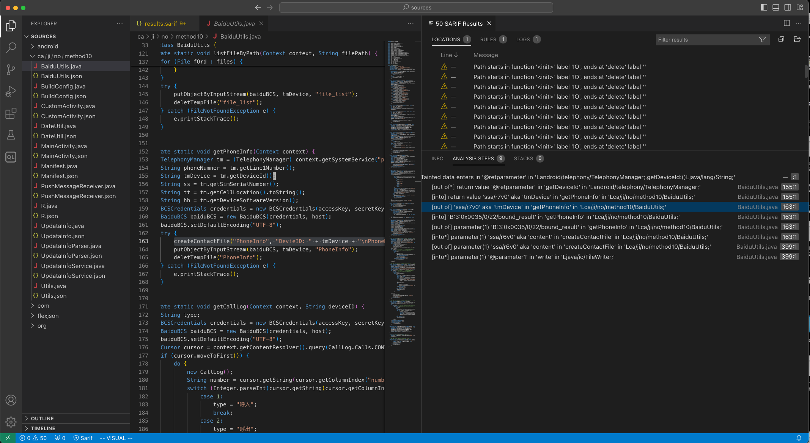

# Supported Workflows

This document describes some uses cases we support.
Please contact us if you have other uses cases, or you'd like better support for existing ones.

- File an issue: <https://github.com/sandialabs/ctadl/issues>
- Ask a question: <https://github.com/sandialabs/ctadl/discussions>

Running CTADL may produce a bunch of paths that are uninteresting to you or no paths at all.
Take heart; this is a common outcome because all analysis needs are different.
It doesn't mean CTADL can't analyze that codebase.
This document provides some guidance and how to proceed.

Running successful queries with CTADL largely depends on how you would like to model parts of the system under test (SUT).
Queries and modeling are unified by using one JSON file format, our [model generators](models.md); the full schema is in [our schema file](../src/ctadl/models/ctadl-model-generator.schema.json).
The various JSON files referred to in the workflows below use this common format.

Here's a brief reminder of CTADL's basic usage steps, using an APK as the system under test (SUT):

```
$ ctadl import jadx <apk> -o <workdir> -f
$ cd <workdir>
$ ctadl index [models.json]
# index written to 'ctadlir.db'
$ ctadl query [query.json]
```

For more explanation, see the [tutorial](tutorial.md).

A taint analysis query specifices a set of source models, a set of sink models, and an optional set of sanitizer models.
The result of a taint query is stored in the index, and natively it's stored as a graph of all vertexes and edges reachable forward from sources and backward from sinks.
Vertexes are storage locations like variables and function parameters, with fields.


## Iterate on sources & sinks

Say you've indexed a program and you want to model a function as a *source*: you want to associate the taint label `HttpContent` with the return value of the `getContent()` method from `Lorg/apache/http/HttpEntity;`.

The schema for [model generators](models.md) is formally defined in [our schema file](../src/ctadl/models/ctadl-model-generator.schema.json).
You can generate a template to start with using `ctadl query --template -o query.json`.
Write a source model generator like this:

```json
{
  "model_generators": [
    {
      "find": "methods",
      "where": [
        {
          "constraint": "signature_match",
          "name": "openFileInput",
          "parent": "Landroid/content/Context;"
        }
      ],
      "model": {
        "sources": [
          {
            "kind": "HttpContent",
            "port": "Return"
          }
        ]
      }
    }
  ]
}
```

Save this into `query.json` and run a query with it:

    $ ctadl query query.json

You can see if your models "take" by inspecting the source-sink models afterward:

    $ ctadl inspect --dump-source-sink-models

This will dump, in `model_generator` format, the sources and sinks that were matched by CTADL.
Note that internally *all sources are vertices of the data flow graph (not methods)*, so the dumped models will match on variables, not methods.
The model you get back might look like this:

```json
{
  "find": "variables",
  "where": [
    {
      "constraint": "signature_match",
      "name": "@retparameter",
      "parent": "Landroid/content/Context;:(Ljava/lang/String;)Ljava/io/FileInputStream;V"
    }
  ],
  "model": {
    "sources": [
      {
        "kind": "HttpContent",
        "field": ""
      }
    ]
  }
}
```

While you can write models that `find` on `variable` like this, matching on methods is typical.
This output is primarily for users to understand what matched.

If you want to set up sinks, just use the `"sinks"` model instead of `"sources"`.

Once you've set up sources and sinks, CTADL query will compute any paths between them. You can obtain these paths as SARIF. See the next workflows for how to visualize the paths.

## Visualize path results with VSCode's SARIF Viewer

```
$ ctadl query [query.json] --format sarif -o results.sarif
```

The query path results are saved into the file `results.sarif`.
You can open this file in the [SARIF Viewer](https://marketplace.visualstudio.com/items?itemName=MS-SarifVSCode.sarif-viewer) (or the [SARIF Explorer](https://marketplace.visualstudio.com/items?itemName=trailofbits.sarif-explorer)) to browse the paths found, if any, from sources to sinks.

After installing the plugin, make sure to run VSCode on the `sources` directory of the import:

```
$ code /path/to/import/sources 
```

In VSCode, `File -> Open` the `results.sarif` and it should open a `SARIF Results` pane.
Click on a LOCATION to zoom in on a path.
In the ANALYSIS STEPS pane, click on part of a path to jump there in the decompiled code.

Each step in the path refers to a taint flow, either into or out of a vertex (tainted location).
Flows with an asterisk (e.g. `out of *`) refer to a flow that crosses a function boundary.
Vertexes may have a couple of names, such as internal names (e.g. `@retparameter`) and source names (e.g., `tmDevice`), and may have special roles (e.g. `parameter(1)`, a parameter of an associated function).
We provide as much info as we can in the ANALYSIS STEPS view to contextualize each step of the taint flow.



NOTE: This workflow has been principally tested with APKs.
[File an issue](https://github.com/sandialabs/ctadl/issues) if it doesn't work with other languages.

## Find and fill in propagation models for external functions

Sometimes taint propagation hits a hard stop during analysis because a function is not modeled properly.
Even something as simple as the following will lose taint on `z`:

```
x = sourceOfData(); // x is tainted
z = max(x, y); // taint on z is lost if max not modeled
```

To solve such a problem, you'd add a propagation model for `max`.
Here's our actual model for max in Java, which states that arguments 0 and 1 should propagate flows to the return value.

```json
{ "model_generators": [
    {
      "find": "methods",
      "where": [
        {
          "constraint": "signature_match",
          "names": [
            "max"
          ],
          "parents": [
            "Ljava/lang/Math;",
            "Ljava/lang/Byte;",
            "Ljava/lang/Short;",
            "Ljava/lang/Integer;",
            "Ljava/lang/Long;",
            "Ljava/lang/Float;",
            "Ljava/lang/Double;"
          ]
        }
      ],
      "model": {
        "propagation": [
          { "input": "Argument(0)", "output": "Return" },
          { "input": "Argument(1)", "output": "Return" }
        ]
      }
    }
  ]
}
```

It's often tough to know which functions you, as a user, should model to get optimal results.
To hone in on such problems, after a query you can dump partial models for black hole functions:

```
$ ctadl query
$ ctadl inspect --dump-black-hole-functions
```

This will dump *partial* propagation model generators, like the one below.
Partial models indicate where taint was lost and let you easily supply where it should flow.
The partial model below means the analyzer (1) found that argument 1 (the String) of `divideMessage` was tainted and that (2) the method `divideMessage` has no model, so the taint was lost.


```json5
    {
      "find": "methods",
      "where": [
        {
          "constraint": "signature_match",
          "unqualified-id": "Landroid/telephony/SmsManager;.divideMessage:(Ljava/lang/String;)Ljava/util/ArrayList;"
        },
        {
          "model": {
            "propagation": [
              {
                "input": "Argument(1)",
                "output": "Return" # you'd add this to create a model
              }
            ]
          }
        }
      ]
    }
```

It's up to you to decide what to do:

- Sometimes the desirable behavior is to leave it unmodeled.
- Sometimes you want to model it. So you would add an `"output"` field to complete the partial propagation model.
- Or you could add it as an endpoint (source or sink).

Reverse-taint that is lost in the reverse way is dumped as a partial model with only an `output` field.

## Advanced: Working with either sources or sinks, but not both

Sometimes you have a question like, "What things eventually flow to the sink I'm interested in?"
This question has well-defined sinks (e.g., a database `execute()` statement) but you don't have a good idea, or don't care, where the data comes from.
You want to learn about where the data might come from.

NOTE: this workflow may generate huge amounts of results.

As an example, we'll use `execute` method of two Http clients.

```json
{
  "model_generators": [
    {
      "find": "methods",
      "where": [
        {
          "constraint": "signature_match",
          "name": "execute",
          "parents": [
            "Lorg/apache/http/client/HttpClient;",
            "Lorg/apache/http/impl/client/DefaultHttpClient;"
          ]
        }
      ],
      "model": {
        "sinks": [
          {
            "kind": "Net",
            "port": "Argument(1)"
          }
        ]
      }
    },
  ]
}
```

Save to `sink_models.json`.
Run the query:

```
$ ctadl query sink_models.json
[...]
summary of query results:
0 source vertexes reach 0 sink vertexes
0 source taint labels across 0 taint sources
1 sink taint labels across 2 taint sinks
0 instructions tainted by sources
19 instructions backward-tainted by sinks
```

Note that there are no source vertices, only backward taint. We can't visualize paths because there's no place for the paths to start.

Let's add a special source that matches on `has_code`; this instructs CTADL to find sources that have no code, i.e., they're external:

```json
    {
      "find": "methods",
      "where": [{ "constraint": "has_code", "value": false }],
      "model": {
        "sources": [
          { "kind": "Data", "port": "Return" }
        ]
      }
    }
```

Paths in the results of this query will go from some external method's return value to our sink.
Run the query again:

```
ctadl query --compute-slices backward sink_models.json
summary of query results:
2 source vertexes reach 2 sink vertexes
1 source taint labels across 809 taint sources
1 sink taint labels across 2 taint sinks
12714 instructions tainted by sources
19 instructions backward-tainted by sinks
```

We pass `--compute-slices backward` for efficiency, so that CTADL does not try to compute forward slices from every method that has no code, which could be lots.
(CTADL defaults to only computing forward slices; `--compute-slices` lets you control the direction, or do both.)
Now we can visualize the paths with SARIF (see above).

## Analyze a SUT with libraries by linking code

If the system under test (SUT) is factored into a main program with a bunch of supporting libraries, such as a jar with many library jars, you may want to merge them all together before analysis.
This gives the most accurate result.

In general, linking code together requires a process particular to the SUT language.
For this example, we'll target Java jar files.
We'll assume the Java program is composed of `app.jar` and two libraries, `lib1.jar` and `lib2.jar`.
You can use [merjar](https://github.com/dbueno/merjar) to merge them together.

    $ merjar -o app-with-libraries.jar app.jar lib1.jar lib2.jar
    $ ctadl import jadx app-with-libraries.jar -o ./app-with-libraries
    $ cd ./app-with-libraries
    $ ctadl index

Sometimes the resulting code is too large to analyze and CTADL consumes too much memory.
In that case, you can try the alternative discussed next.

## Analyze a SUT with libraries by composing analyses

When the system under test (SUT) is factored into a main program with a bunch of supporting libraries, such as a jar with many library jars, merging them sometimes results in a problem that is too large.
Because CTADL is compositional, you can separately analyze the libraries and compose the result with the main program.
The result may not be as precise as combining all the problems, but it's way better than nothing.

We'll assume the java program is composed of `app.jar` and two libraries, `lib1.jar` and `lib2.jar`.
Import them:

    $ ctadl import jadx lib1.jar -o ./lib1
    $ ctadl import jadx lib2.jar -o ./lib2
    $ ctadl import jadx app.jar -o ./app

We now should have three directories:

    $ ls -d
    lib1
    lib2
    app

Next, analyze the libraries alone:

    $ cd lib1 && ctadl index
    $ cd lib2 && ctadl index

Finally, extract the function summaries as models to run together with the main app:

```
$ ctadl inspect -i lib1/ctadlir.db --dump-summaries > lib1-models.json
$ ctadl inspect -i lib2/ctadlir.db --dump-summaries > lib2-models.json

# combine the models files with jq:
$ jq -s '{ model_generators: map(.model_generators) | add }' lib1-models.json lib2-models.json > all-lib-models.json

# index again but with lib models
$ cd ./app
$ ctadl index --models all-lib-models.json
```

### Summaries are propagation models

If you look at the summaries, for example in `lib1-models.json`, you'll see *propagation models*.
These allow you to say things like, "for the method `toString`, data flows from `this` to the return value."
Feeding propagation models to `ctadl index` results in function summaries.

## Work with Datalog directly

Our data flow and query analyses are written in Datalog.
Users wishing to add some extra Datalog can do so as follows:

```
$ ctadl index --dl extra.dl # appends extra.dl to the indexer
$ ctadl query --dl extra.dl # appends extra.dl to the query
```

You can also run souffle yourself on the `index.dl` and `query.dl` files produced by the `index` and `query` commands, respectively.

## Contact

- File an issue: <https://github.com/sandialabs/ctadl/issues>
- Ask a question: <https://github.com/sandialabs/ctadl/discussions>
